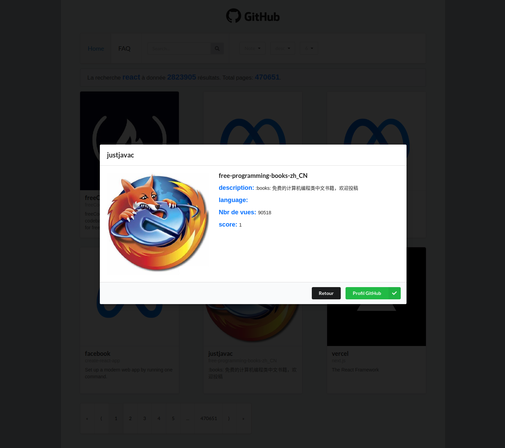

# react-api-GitHub-training

Training from scratch. From my React specialization with the O'Clock school.

## learning in this training:

* React: useState / useEffect
* Axios for connecting API
* Semantic-UI Framework CSS
* react-router-dom: navbar/navigate/routes/route/...
* Varius React: proptypes, controlled element, ... 

## developed features:

* Various sorting for research
* selection of the number of elements displayed
* spinner with onload State
* search bar
* modal window
* paging
* of course no reloading

Lien vers le résultat final : [ICI](https://henriteinturier.github.io/react-api-GitHub-training/)

|        Apperçu        |
| :-------------------: |
|  |
